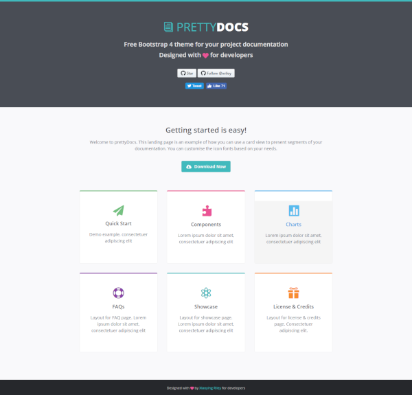

# Jekyll Theme PrettyDocs

Inspired on https://themes.3rdwavemedia.com/demo/prettydocs/

# Dependency

Jekyll ~> 3.3

# Quick start

```bash
jekyll new mydoc
cd mydoc
```

Add this line to your Jekyll site's Gemfile:

```ruby
gem "jekyll-theme-prettydocs"
```

```bash
bundle install
```

After yor install theme, you should replace `minima` theme for new `jekyll-theme-prettydocs` theme.
To do it, change in `_config.yml` file, like this:

```yaml
# Replace
theme: minima

# By
theme: jekyll-theme-prettydocs
```

To start jekyll server, run:

```bash
bundle exec jekyll serve
```

Open in your browser `http://localhost:4000`. See the site, with this wonderful theme.



**After you install and start, you can to do your changes.**

# Files and folder structures

The files of version 1.0.0 was totally rewrite. In practically, It started from zero.

The idea was reduce project size, and to make it more simple and clean as possible. To do it, there was a change of thinking. From now on, the idea is hand over the layouts and to allow the user to build your pages as you like.

However with the help of [Tips Page](https://github.com/maiconpinto/jekyll-theme-prettydocs/wiki/Tips-page), you will be able to replicate and to adapt the content of Pretty Docs template with more facility and simplicity.

This is the idea.

```
\_includes
    footer.html
    home.html
    promo-block.html
\_layouts
    home.html
    page.html
```

# Layouts

## Home

The Home Layout is the base of initial page of theme. Basically, the `_includes/home.html` file is included, and is responsible of main content of home page. Therefore, to make changes you will create a file with same name, and it show on home page.

You can access the [Wiki](https://github.com/maiconpinto/jekyll-theme-prettydocs/wiki) to learn how you to create your Home Page step-by-step.

## Page

One of the big differences between version 1.0.0 to 0.0.5 is the Page Layout. This version is more easy to define the page color. You have only to include `color: green` attribute, for example, to this page assume the green color.

Still is not possible to create automagically a page, but thinking on more facility of the development, was created some code lines that, used together with Emmet plugin will facility more your life.

To start, you should think that all pages follow the same pattern of code, with exception of content of page, the structure is the same.

Then...

Following this idea, you will have in a simplicity way the following structure of a page:

```html
---
layout: page
title: Quick Start
permalink: quick-start
color: green
---

# header 

header#header.header>div.container>((div.branding>h1.logo>a[href="/"]>span.icon_documents_alt.icon[aria-hidden="true"]+span.text-highlight{Pretty}+span.text-bold{Docs})+(ol.breadcrumb>((li.breadcrumb-item>a[href="/"]{Home})+(li.breadcrumb-item.active{Quick Start}))))

# content

div.doc-wrapper>div.container>(div#doc-header.doc-header.text-center>(h1.doc-title>i.icon.fa.fa-paper-plane+{Quick Start})+div.meta>i.far.fa-clock+{Last updated: July 18th, 2018})+(div.doc-body.row>(div.doc-content.col-md-9.col-12.order-1>div.content-inner{#sections})+(div.doc-sidebar.col-md-3.col-12.order-0.d-none.d-md-flex>div#doc-nav.doc-nav>nav#doc-menu.nav.doc-menu.flex-column.sticky{#menu-itens}))

# sections

section#replace-section.doc-section>(h2.section-title{#replace})+(div.section-block>(h3.block-title{#title})+(p{#content}))

# menu-itens

a.nav-link.scrollto[href="#download-section"]{Download}

nav.doc-sub-menu.nav.flex-column>a.nav-link.scrollto[href="#download-section"]{Download}

# footer

footer#footer.footer.text-center>div.container>small.copyright(({Designed with}>i.fa.fa-heart)+({ by }>a[target="_blank" href="https://themes.3rdwavemedia.com/"]{Xiaoying Riley})+{for developers})
```

For more details, click in [Tips Page](https://github.com/maiconpinto/jekyll-theme-prettydocs/wiki/Tips-page).

